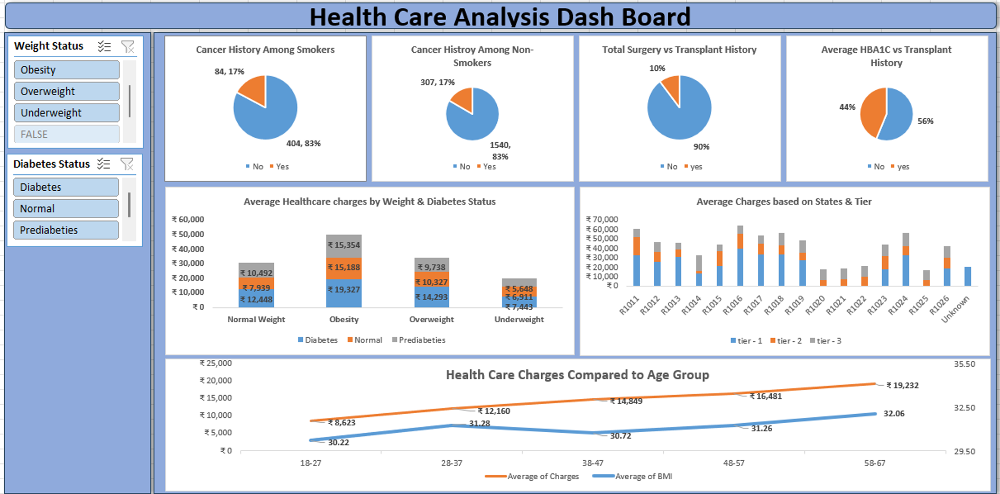

# 🏥 Healthcare Operations & Patient Analytics Dashboard (Advanced Excel)

An interactive, multi-sheet **Healthcare Operations & Patient Analytics Dashboard** built in Microsoft Excel. This project showcases advanced data modeling with **Power Query** and **Power Pivot**, multi-source table consolidation, dynamic lookup formulas, and interactive KPI visualization using synchronized slicers and Pivot Charts.

---

## 📌 Project Overview

Operational efficiency in healthcare facilities directly influences patient outcomes, bed occupancy rates, and overall resource allocation. This project processes raw hospital operational data to deliver an executive-ready operational dashboard that tracks:
- **Patient Inflow & Admission Volumes**: Monitoring admission distributions across clinical departments, admission types (Emergency vs. Elective), and demographic segments.
- **Departmental Workload & Wait Times**: Identifying bottlenecks in patient wait times, consultation durations, and discharge turnaround times.
- **Data Consolidation & Modeling**: Merging disparate data records across multiple sheets into a unified data model using Power Query and Power Pivot.

---

## 🛠️ Tech Stack & Advanced Excel Techniques

* **Software**: Microsoft Excel (Office 365 / Excel 2021+)
* **ETL & Data Modeling**:
  * **Power Query**: Automated ETL pipelines for data type standardization, null handling, custom column creation, and merging multi-sheet tables.
  * **Power Pivot & Data Model**: Establishing 1-to-many relationships across patient records, department lookup tables, and temporal data.
* **Formulas & Functions**:
  * **Dynamic Lookups**: `XLOOKUP`, `INDEX-MATCH`, `VLOOKUP` for relational cross-referencing.
  * **Conditional Aggregations**: `SUMIFS`, `COUNTIFS`, `AVERAGEIFS` for segmented metric computations.
  * **Text & Date Formatting**: `TEXT`, `DATEDIF`, `IFERROR`, `UNIQUE`, dynamic array handling.
* **Interactive Visualization**:
  * Consolidated **Pivot Tables** linked to a single data model.
  * **Pivot Charts**: Bar charts, trend lines, donut charts, and department breakdown visuals.
  * **Synchronized Slicers & Timeline Controls**: Multi-visual filtering by Department, Admission Type, Doctor/Specialty, and Date Range.

---

## 📊 Key Dashboard Insights & Metrics

1. **Patient Volume & Department Distribution**:
   - Mapped patient distribution across key departments (Emergency, Inpatient, Outpatient, ICU) to identify high-load clinical units.
2. **Operational Bottlenecks & Wait Times**:
   - Analyzed average triage-to-admission wait times, isolating time-of-day peak congestion periods.
3. **Length of Stay (LOS) & Bed Utilization**:
   - Evaluated patient recovery timelines and bed turnover rates to assist in capacity planning.

---

## 📸 Dashboard Preview



---

## 🚀 How to Open & Explore the Project

1. **Clone the Repository:**
   ```bash
   git clone [https://github.com/ashilbrayan/Healthcare-Operations-Patient-Analytics-Excel.git](https://github.com/ashilbrayan/Healthcare-Operations-Patient-Analytics-Excel.git)
